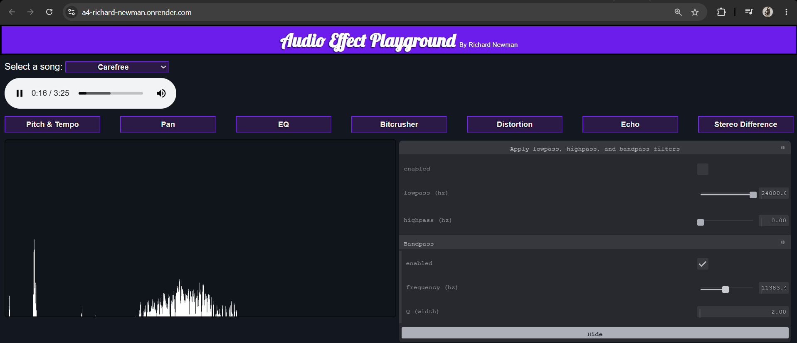

# Richard Newman - Assignment 4 - Creative Coding: Interactive Multimedia Experiences

## Audio Effect Playground

By Richard Newman
 
https://a4-richard-newman.onrender.com/

This application uses the Web Audio API to make a webpage where various audio effects can be experimented and played with by the user. The UI allows users to select one of four sample songs or upload a song of their choosing, which is then played through an audio element and visualized through an analyzer node to display the frequency data. The user can then play with many different audio effects by clicking on the corresponding button and tweaking the parameters within the tweakpane that appears. Since the effects can be routed to each other, all of these effects can be used at once if desired. These effects include: pan, EQ, pitch, tempo, bitcrusher, distortion, reverb, and stereo difference.

The main challenges I faced were settling on a structure for chaining audio nodes; the final implementation is functional, but could prove to be more efficient, since audio nodes will be connected and active even when disabled and the tweakpane control JS code is slightly more dependent on the contents of main.js than ideal. Additionally, figuring out how to use and debugging the custom Audio Worklet Nodes I needed to make for the bitcrusher and stereo difference effect took quite a bit of time, even after following [the chrome developer tutorial](https://developer.chrome.com/blog/audio-worklet/), though was quite satisfying once it finally came together.
